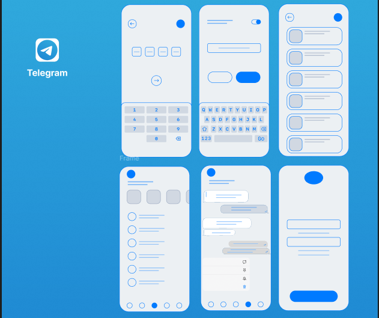

# 💬 Telegram Mobile App – UI Framework (Figma Design)

## 📌 Overview
This project is a **UI/UX framework design** inspired by the Telegram messaging application.  
Created using **Figma**, it presents a **multi-screen prototype** showcasing a **modern, clean, and scalable design system** for a chat-based mobile application.

---

## 🎨 Key Features
- **Multiple high-fidelity screens**, including:
  - ✅ Splash & Onboarding screens  
  - ✅ Login & OTP verification  
  - ✅ Keyboard input & message typing  
  - ✅ Chat list view with recent conversations  
  - ✅ One-to-one chat interface with message bubbles  
  - ✅ Settings and user profile management screen
- Consistent **color palette**, **typography**, and **iconography** for a smooth user experience.
- Modular **UI components** designed for reusability in real-world app development.

---

## 🛠 Tools Used
- **Figma** – For wireframing, prototyping, and creating high-fidelity UI screens.
- **UI/UX Design Principles** – Focus on usability, accessibility, and scalability.
- **Icon Libraries** – Used for buttons, navigation bar, and chat indicators.

---

## 🔗 Live Prototype
👉 [**View Design on Figma**](https://www.figma.com/design/pqqnAhR9QmXhp3xw9JBmAA/Untitled?node-id=0-1&t=2BISd25RyrGf0HzL-0)

---

## 📂 Project Structure

---

# 💻 UI Preview

---

## 📌 Conclusion
This project demonstrates my skills in **UI/UX design, wireframing, and multi-screen mobile app prototyping**.  
It serves as a **framework reference** for developing a **Telegram-inspired mobile messaging application** with a **modern and user-friendly interface**.

